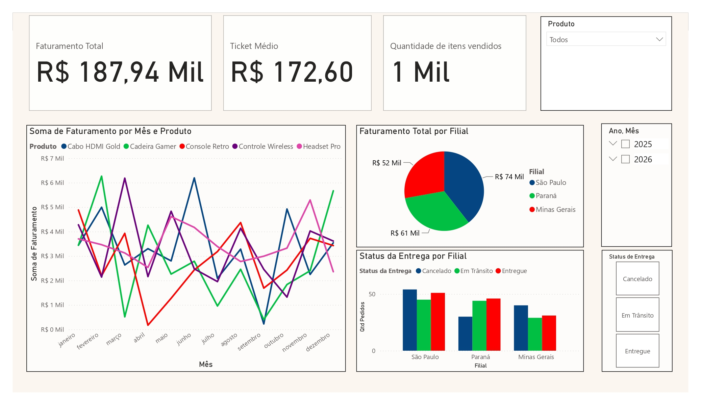

# Projeto Pipeline de Dados Logísticos

## ETL e Consolidação de Filiais

Este projeto simula um cenário real de engenharia e análise de dados em uma operação de e-commerce/logística com três filiais regionais (São Paulo, Paraná e Minas Gerais). O objetivo principal foi construir um pipeline robusto que extrai dados brutos fragmentados, aplica regras pesadas de limpeza e transformação (ETL) e entrega um dashboard estratégico para tomada de decisão. 

## Arquitetura do Projeto & Desafios Técnicos

Para simular o "caos" comum do dia a dia de uma empresa, utilizei Inteligência Artificial para gerar um script em Python personalizado. Esse script gerou as bases fictícias das filiais em formato .xlsx inserindo, de propósito, anomalias e inconsistências estruturais clássicas que demandam tratamento avançado de dados:

* Filial São Paulo (Vendas_Filial_SP.xlsx): Colunas geradas com nomenclatura fora do padrão original (Data_Venda e Valor_Unitario).

* Filial Paraná (Vendas_Filial_PR.xlsx): Arquivo corrompido propositalmente com 3 linhas em branco no topo, colunas com cabeçalhos diferentes (DT_FATURAMENTO) e uma linha de Total Geral fake no final da planilha.

* Filial Minas Gerais (Vendas_Filial_MG.xlsx): Inserção de erros de escala de milhar (valores sem vírgula, multiplicados por 1.000, simulando falha de digitação ou importação).

## Tecnologias Utilizadas 
* Python: Geração de dados sintéticos e simulação de anomalias com a biblioteca Pandas.

* Power Query (Linguagem M): Processamento, limpeza e transformação dos dados (ETL).

* Power BI (DAX): Modelagem de dados, criação de métricas e design do painel visual.

## O Processo de ETL (Extração, Transformação e Carga) 
Em vez de utilizar o conector automatizado de pastas do Power BI (que quebraria com a diferença de estruturas), o tratamento foi realizado de forma modular e granular para garantir a escalabilidade:

* Isolamento e Limpeza: Cada tabela foi tratada individualmente no Power Query para remover linhas nulas, saltar os cabeçalhos incorretos do Paraná e filtrar totais fakes.

* Padronização de Esquema: Renomeação e alinhamento de colunas para garantir que tipos de dados idênticos conversassem entre si.

* Carimbagem de Origem: Criação de uma coluna personalizada de identificação de estado antes da união.

* Consolidação (Append): Unificação das três tabelas em uma única Tabela Fato otimizada (Fato_Vendas), desabilitando a carga das tabelas menores para otimizar a performance do modelo (Star Schema).

* Tratamento de Escala Extrema: Aplicação de lógica condicional na Linguagem M para detectar e corrigir os preços inflacionados por 1.000 vindos da planilha de Minas Gerais.

## Insights de Negócio Gerados
O produto final entrega métricas cruciais de faturamento e comportamento operacional:

* Faturamento Geral: Identificação de uma receita total de R$ 187,94 Mil com um Ticket Médio global de R$ 172,60.  

* Concentração de Mercado: A filial de São Paulo lidera o faturamento com R$ 74 Mil, seguida por Paraná (R$ 61 Mil) e Minas Gerais (R$ 52 Mil).  

* Gargalo Logístico Crítico (O Insight Principal): O gráfico de status revela um problema alarmante em São Paulo e Minas Gerais: nessas regiões, o volume de pedidos cancelados supera o volume de pedidos entregues. Este insight indica uma falha severa na eficiência das transportadoras locais ou problemas na etapa de checkout.  

## Boas Práticas visuais aplicadas
* Uso de menu lateral dedicado para Filtros Dinâmicos (Segmentadores) por Data e Status de Entrega. 

* Paleta de cores minimalista e corporativa, evitando poluição visual.

* Alinhamento rigoroso dos componentes em formato de cards utilizando as linhas de grade para melhor legibilidade.

## Como Executar o Projeto
*1º* Execute o script src/gerador_de_dados.py para criar a pasta com as planilhas brutas. 

*2º* Abra o arquivo .pbix no Power BI. 

*3º* Atualize o caminho da fonte de dados no Power Query para apontar para o seu diretório local.

